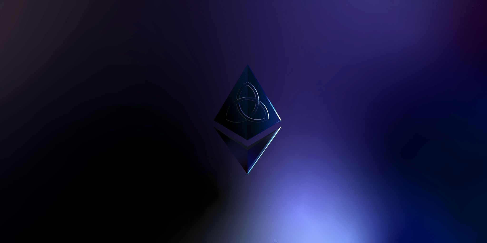

<!--
parent:
  order: false
-->

  <h1> Ethermint </h1>

  
  
  
  
  

  
  
  
  

Ethermint is a scalable, high-throughput Proof-of-Stake blockchain that is fully compatible and
interoperable with Ethereum. It's build using the the [Cosmos SDK](https://github.com/cosmos/cosmos-sdk/) which runs on top of [Tendermint Core](https://github.com/tendermint/tendermint) consensus engine.

**Note**: Requires [Go 1.16+](https://golang.org/dl/)

## Quick Start

To learn how the Ethermint works from a high-level perspective, go to the [Introduction](./docs/intro/overview.md) section from the documentation.

For more, please refer to the [Ethermint Docs](./docs/), which are also hosted on [ethermint.dev](https://ethermint.dev/).

### Community

The following chat channels and forums are a great spot to ask questions about Ethermint:

- [Cosmos Discord](https://discord.gg/W8trcGV)
- [Cosmos Forum](https://forum.cosmos.network)
