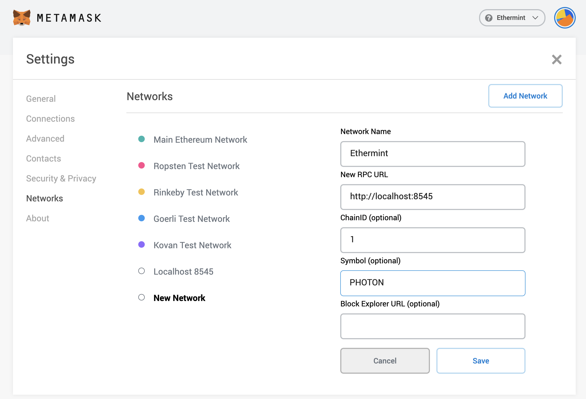
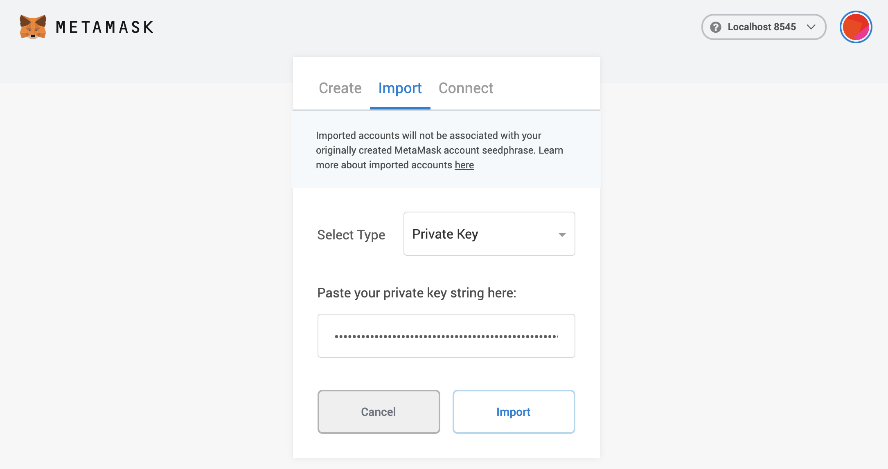

<!--
order: 2
-->

# Metamask

Connect your Metamask wallet with Ethermint on a localnet mode. {synopsis}

## Adding a custom Network for Ethermint

One of the main limitations of using the default `Localhost 8545` network is that the tokens will be represented as `ETH`.

Open the Metamask extension on your browser, you may have to log in to your Metamask account if you
are not already. Then click the top right circle and go to `Settings` > `Networks`. Press the `Add
Network` button and fill the form as shown below with your application `ChainID`.

::: tip
To find your full `ChainID`, got your genesis.json file. To get the [EIP155](https://github.com/ethereum/EIPs/blob/master/EIPS/eip-155.md) chain ID from the Cosmos chain ID, you need to consider only the second number in the string value. For example
if your chain id on ethermint is `"chain_id": "ethermint_9000-1"`, then you will have to use the value `9000` on Metamask.
:::



## Import Account to Metamask

Then close the settings, and go to `My Accounts` (top right circle) and select `Import Account`. You should see and image like the following one:



Now you can export your private key from the terminal using the following command. Again, make sure
to replace `mykey` with the name of the key that you want to export:

```bash
ethermintd keys unsafe-export-eth-key mykey
```

Go back to the browser and select the `Private Key` option. Then paste the private key exported from
the `unsafe-export-eth-key` command.

Your account balance should show up as `1 APHOTON` and do transfers as usual.

::: tip
If it takes some time to load the balance of the account, change the network to `Main Ethereum
Network` (or any other than `Localhost 8545` or `Ethermint`) and then switch back to `Ethermint`.
:::

## Downloading State

to see metamask logs, go to top right circle -> settings -> advanced -> download state logs. if you search through the json file for the account address you'll find the tx history
