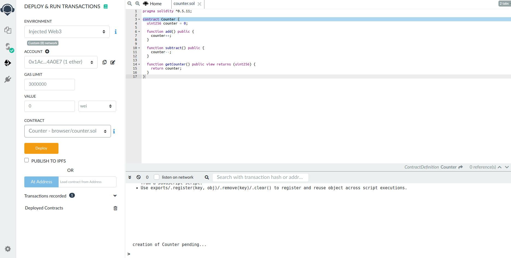
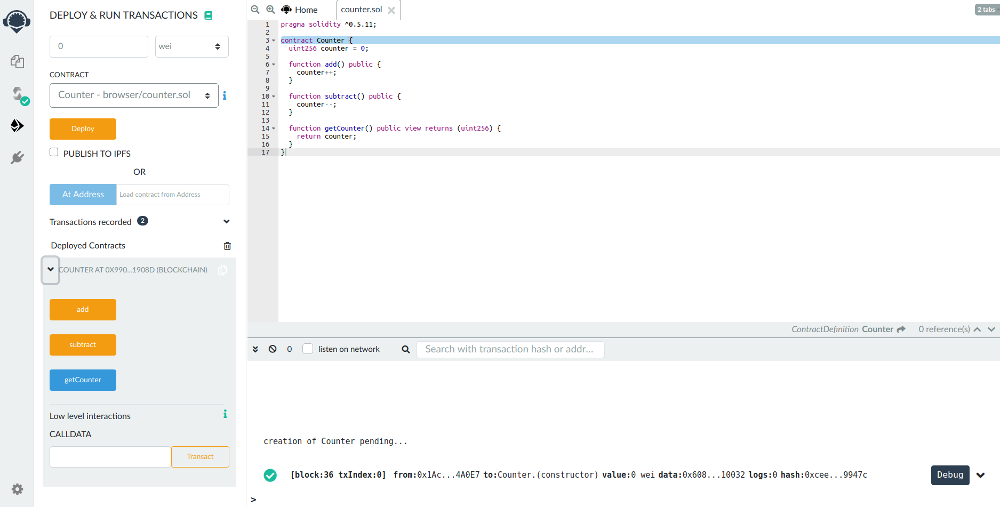
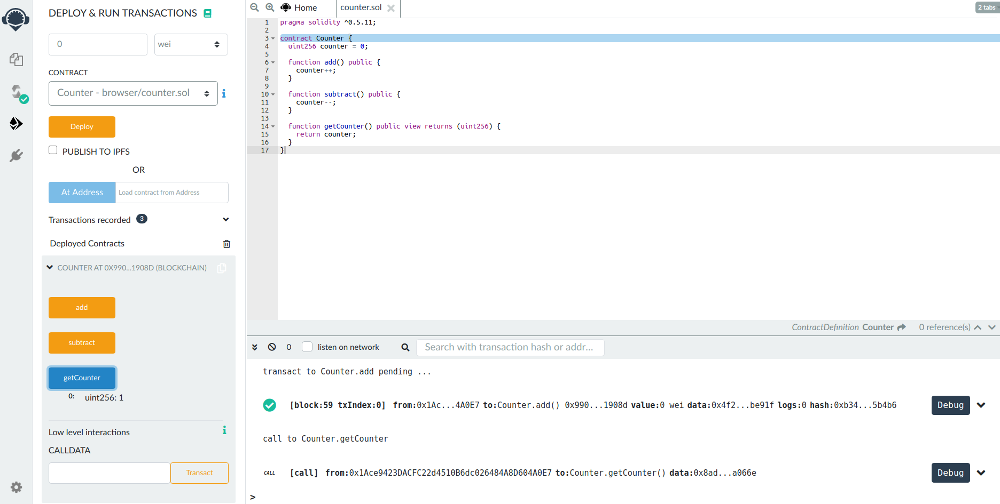

<!--
order: 1
-->

# Remix: Deploying a Smart Contract

Learn how to deploy a simple Solidity-based smart contract to Ethermint using the Remix in-browser IDE {synopsis}

## Pre-requisite Readings

- [Installation](./../../quickstart/installation.md) {prereq}
- [Run a node](./../../quickstart/run_node.md) {prereq}
- [MetaMask](../keys-wallets/metamask.md) {prereq}

[Remix](http://remix.ethereum.org/) is an in-browser IDE for [Solidity](https://github.com/ethereum/solidity) smart contracts. In this guide, we will learn how to deploy a contract to a running Ethermint network through Remix and interact with it.

## Connect Ethermint account to Remix

::: tip
If you haven’t already, follow the steps in the [Metamask guide](.//metamask.md) to import your Ethermint private key into Metamask. Start the Ethermint daemon and REST server.
:::

Go to [Remix](http://remix.ethereum.org/). There are some contracts in the File Explorer. Replace these with the source code to `Counter.sol` below. On the left-most bar, select the Solidity Compiler and compile the contract.

```javascript
pragma solidity >=0.7.0 <0.9.0;

contract Counter {
  uint256 counter = 0;

  function add() public {
    counter++;
  }

  function subtract() public {
    counter--;
  }

  function getCounter() public view returns (uint256) {
    return counter;
  }
}
```

Next, select the `Deploy and Run` option. Select `Injected Web3` as the `Environment`. This will open a metamask popup for you to connect your Metamask to Remix. Select `Connect` to confirm.

You should see your account show up in the left-hand panel.



## Deploy and Interact

Now that your account is connected, you are able to deploy the contract. Press the `Deploy` button. A metamask pop-up will appear asking you to confirm. Confirm the transaction.  You should see a log for the deployment transaction in the Ethermint daemon logs:

```bash
I[2020-07-15|17:26:43.155] Added good transaction                       module=mempool tx=877A8E6600FA27EC2B2362719274314977B243671DC4E5F8796ED97FFC0CBE42 res="&{CheckTx:log:\"[]\" gas_wanted:121193 }" height=31 total=1
```

Once the contract has been successfully deployed, you will see it show up in the `Deployed Contracts` section in the left-hand side, as well as a green check in the Remix console showing the transaction details.



Now, you are able to interact with the contract through Remix. For `Counter.sol`, click `add`. This will open a Metamask pop-up asking you to confirm. Confirm the transaction. Then, click `getCounter` to get the count, which should be `1`.


